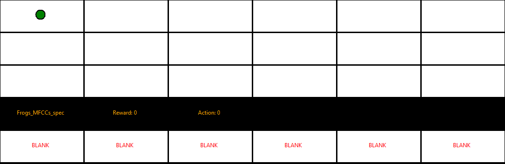

# gym-deepline


This project is the implementation of DeepLine, a system for automatic machine learning pipeline generation. 
DeepLine is a deep reinforcement learning-based framework. It consists of a grid-world environment in which the pipeline generation process is modeled in a semi-constrained setting, and a DDQN agent.

DeepLine also introduces a novel method for handling large discrete action spaces where most of the actions are invalid in most states. The Hierarchical Step filters only the set of vaild actions by quering the agent iteratively on small subsets of the actions space. 
Extensive description of the framework is available in the `Thesis_Yuval.pdf` file.

## Installation
After cloning the repository, do the following:
```bash
cd gym-deepline
pip install -e .
```
The code is implemented in `Python 3.6`.

## Instructions
DeepLine's environment is implemented as an [OpenAI-Gym](https://gym.openai.com/) environmnet, and can be called by:
```python
import gym
import gym-deepline

env = gym.make('deepline-v0')
```

The environment itself is implemented in `envs/atml_env.py` and the three versions of the agent are under `agents/`.

For a more detailed example, see `example.py`.
